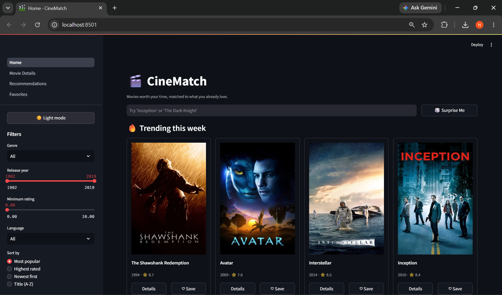
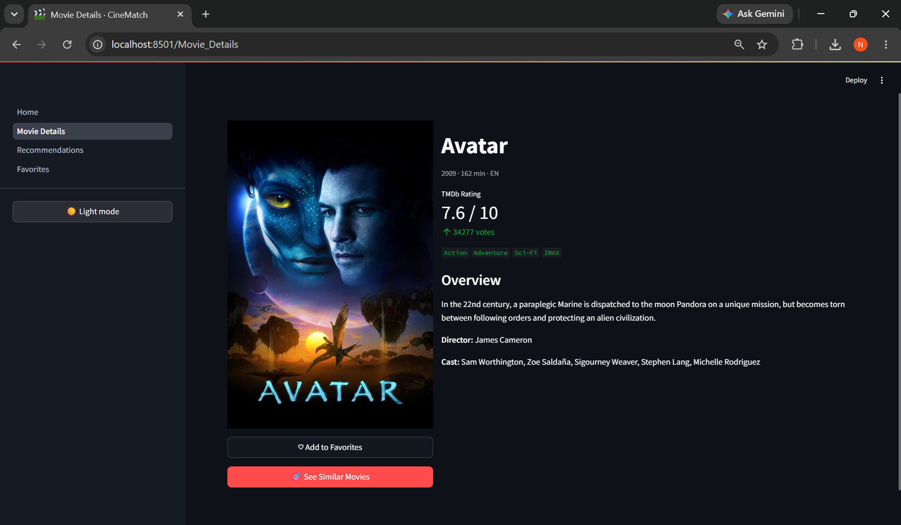
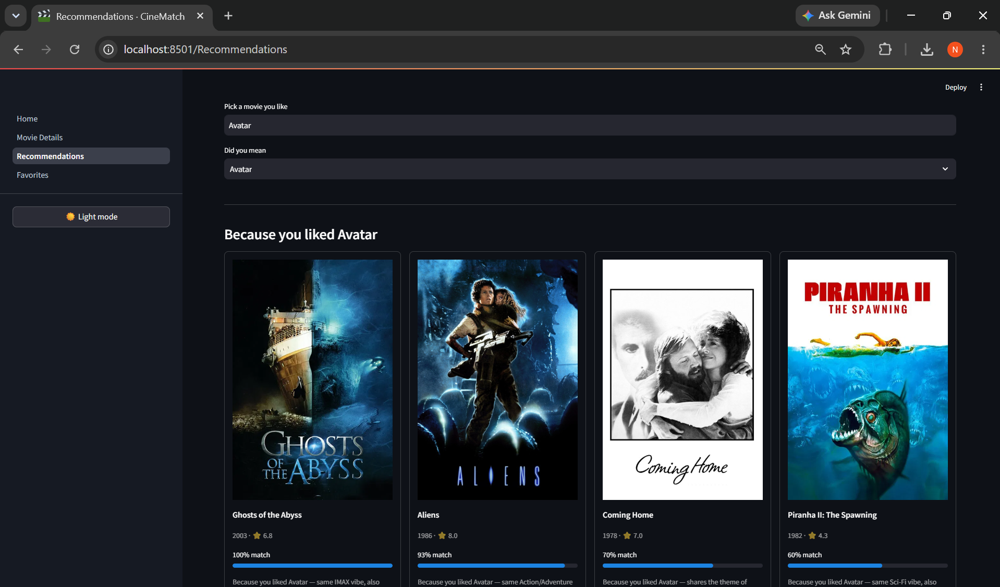
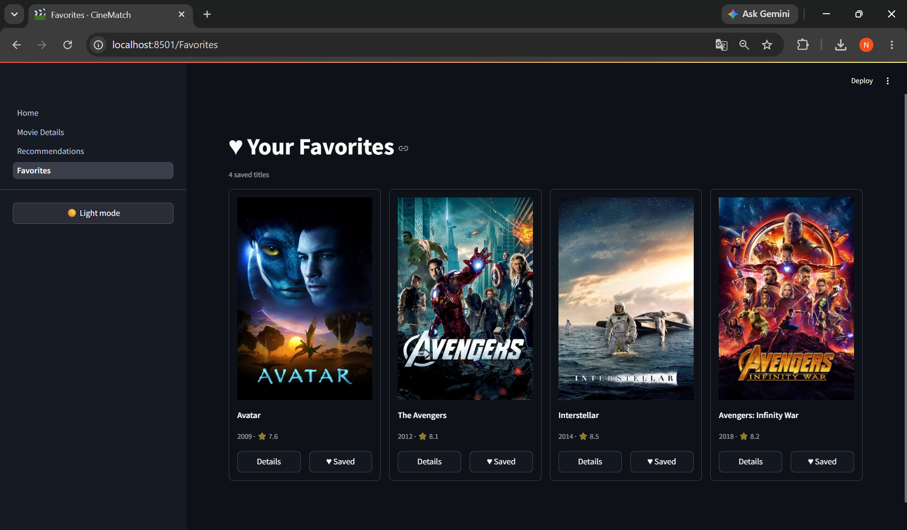

# 🎬 CineMatch – AI-Powered Movie Recommendation System

> A content-based movie recommendation system that recommends movies based on their content rather than user ratings.
>
> Built with **Python**, **Streamlit**, **Scikit-learn**, **MovieLens**, and **TMDb API**.

---

## 📌 Overview

CineMatch helps users discover movies similar to the ones they already love.

Instead of relying on other users' ratings, it analyzes each movie's:

- 🎭 Genres
- 🎬 Director
- 👥 Cast
- 🏷️ Keywords
- 📝 Plot Overview

Using these features, CineMatch generates highly relevant recommendations and explains *why* each movie was recommended.

The recommendation model is built completely offline, making the application extremely fast during runtime.

---

## ✨ Features

- 🔍 Search from **10,000+ movies**
- 🎯 AI-powered content-based recommendations
- 🎲 Surprise Me feature
- 🔥 Trending Movies
- ❤️ Favorites
- 🎬 Detailed Movie Information
- 🎭 Genre, Rating, Language & Year Filters
- 🌙 Light & Dark Theme
- ⚡ Precomputed recommendation engine for instant results

---

## 🖼️ Screenshots

## 🏠 Home Page



---

## 🎬 Movie Details



---

## 🎯 Recommendations



---

## ❤️ Favorites



---

# 🧠 Recommendation Pipeline

```
MovieLens Dataset
        │
        ▼
TMDb Enrichment
(Cast, Crew, Keywords,
Overview, Posters)
        │
        ▼
Feature Engineering
(Tag Soup)
        │
        ▼
TF-IDF Vectorization
        │
        ▼
Cosine Similarity Matrix
        │
        ▼
Precomputed Recommendation Model
        │
        ▼
Streamlit Web Application
```

---

# ⚙️ How Recommendations Work

Every movie is converted into a weighted feature representation.

The recommendation engine combines:

- Genres
- Director
- Top Cast
- Keywords
- Movie Overview

These features are merged into a single text corpus ("Tag Soup").

The corpus is vectorized using **TF-IDF**, which assigns higher importance to unique descriptive words while reducing the weight of common terms.

Finally, **Cosine Similarity** is computed between every movie pair to identify the most similar movies.

Because the similarity matrix is generated offline, recommendations are returned instantly during runtime.

---

# 📂 Dataset

CineMatch combines two datasets:

### MovieLens

Provides

- Movie titles
- Genres
- TMDb IDs

### TMDb API

Enriches each movie with

- Posters
- Cast
- Director
- Keywords
- Runtime
- Release Year
- Ratings
- Popularity
- Overview

Current catalog contains approximately **10,000 movies**.

---

# 🏗️ Project Architecture

```
MovieLens Dataset
        │
        ▼
scripts/build_model.py
        │
        ▼
Processed Dataset
(movies.parquet)
        │
        ├──────────────► TF-IDF Vectorizer
        │
        ├──────────────► Cosine Similarity Matrix
        │
        └──────────────► Movie Index
                       │
                       ▼
                Streamlit Application
```

---

# 📁 Project Structure

```
app/
│
├── components/
├── pages/
├── Home.py
│
core/
├── data/
├── recommender/
├── tmdb/
│
scripts/
└── build_model.py
│
config/
│
data/
├── raw/
├── processed/
└── model/
```

---

# 🚀 Installation

Clone the repository

```bash
git clone <repository-url>
cd CineMatch
```

Create a virtual environment

```bash
python -m venv venv
```

Activate it

### Windows

```bash
venv\Scripts\activate
```

### Linux / macOS

```bash
source venv/bin/activate
```

Install dependencies

```bash
pip install -r requirements.txt
```

Create a `.env` file

```
TMDB_API_KEY=your_api_key_here
```

Download the MovieLens dataset and place

```
movies.csv
links.csv
```

inside

```
data/raw/
```

---

# 🏗️ Build Recommendation Model

Example:

```bash
python -m scripts.build_model --limit 10000 --workers 8
```

The build pipeline

- downloads TMDb metadata
- enriches MovieLens
- generates feature corpus
- trains TF-IDF vectorizer
- computes cosine similarity matrix
- saves all model artifacts

---

# ▶️ Run the Application

```bash
streamlit run app/Home.py
```

---

# 🛠️ Tech Stack

### Languages

- Python

### Machine Learning

- Scikit-learn
- TF-IDF Vectorizer
- Cosine Similarity

### Framework

- Streamlit

### Data Processing

- Pandas
- NumPy

### APIs

- TMDb API

### Dataset

- MovieLens

---

# 💡 Design Decisions

### Why Content-Based Filtering?

Unlike collaborative filtering, content-based recommendation:

- works for every user immediately
- doesn't require historical ratings
- avoids the cold-start problem
- provides explainable recommendations

---

### Why Precompute Similarity?

The recommendation model is generated offline.

At runtime the application only loads precomputed artifacts, making recommendations nearly instantaneous.

---

### Why MovieLens + TMDb?

MovieLens provides reliable movie metadata while TMDb enriches it with posters, cast, directors, keywords, ratings and additional information.

---

# 🔮 Future Improvements

- Approximate Nearest Neighbor Search (FAISS)
- Hybrid Recommendation System
- User Authentication
- Watchlists
- Collaborative Filtering
- Persistent Favorites
- Docker Deployment
- Cloud Deployment
- Multi-language Support

---

# 👨‍💻 Author

**Nayan Agarwal**

B.Tech Information Technology (2025-2029)
JECRC Foundation, Jaipur

GitHub: *https://github.com/NayanAgarwal7*

LinkedIn: *https://www.linkedin.com/in/nayanagarwal7/*

---

## ⭐ If you found this project interesting, consider giving it a star!